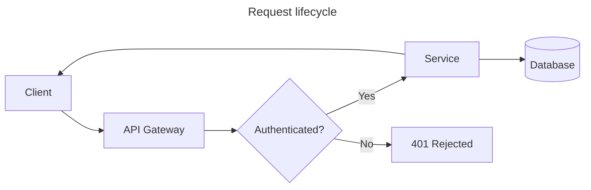
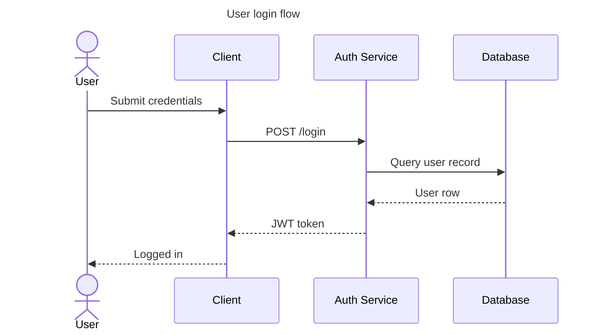
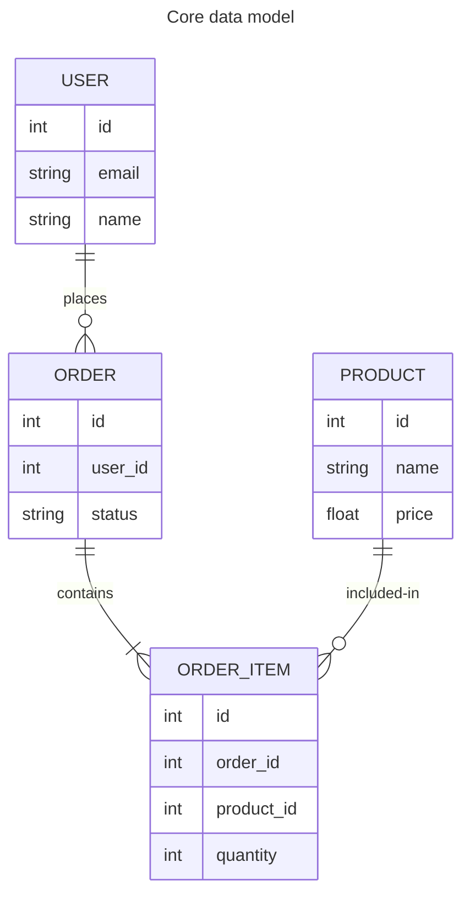

# Markdown Formatting Guidelines

## Headings

Use `#` through `######` to express document hierarchy. Do not skip heading levels. Place one
blank line before and one blank line after every heading. Do not end heading text with punctuation.
Use sentence case for headings.

```markdown
# Top-level Title

## Section

### Subsection
```

## Paragraphs

Separate paragraphs with a single blank line. Wrap lines at 100 characters, breaking at word
boundaries. Do not hard-wrap lines shorter than 100 characters unless a line break is semantically
meaningful.

## Emphasis

Use `*italic*` for italic text. Use `**bold**` for bold text. Use `***bold italic***` for bold
italic text. Do not use the underscore variants (`_italic_`, `__bold__`).

## Lists

Use `-` for unordered list items. Do not use `*` or `+`. Use `1.` for every item in ordered lists
and let the renderer handle numbering. Indent nested list items by 2 spaces. Place a blank line
before and after a list block when it is surrounded by prose. Do not place blank lines between
tight list items.

```markdown
- First item
- Second item
  - Nested item
  - Nested item
- Third item
```

```markdown
1. First step
1. Second step
   1. Sub-step
1. Third step
```

## Code

Use backticks for inline code: `` `code` ``. Use fenced code blocks with a language identifier for
multi-line code. Do not use 4-space indentation to create code blocks.

````markdown
```typescript
function greet(name: string): string {
  return `Hello, ${name}`;
}
```
````

## Mermaid Diagrams

Declare Mermaid diagrams as fenced code blocks with the `mermaid` language tag. Use 2-space
indentation inside the diagram definition. Include one diagram type per block; do not mix diagram
types. Keep node and actor labels short — do not exceed 40 characters. Prefer `LR` (left-to-right)
direction for flowcharts unless a top-down layout (`TD`) better suits the content. Always precede a
diagram with prose that explains its purpose. Do not let a diagram stand alone without context.

When the diagram's purpose is not immediately clear from surrounding prose, add a title using the
`---\ntitle: ...\n---` front matter block inside the code fence.

**Flowchart** — use for processes, decision trees, and data flow:

````markdown

````

**Sequence diagram** — use for interactions between actors over time:

````markdown

````

**Entity relationship diagram** — use for data models and schema relationships:

````markdown

````

## Links and Images

Use inline syntax for links: `[link text](url)`. Use reference-style links when the same URL
appears more than once in a document. Always include descriptive alt text for images.

```markdown
[OpenCode docs](https://opencode.ai/docs)


[repeated link][ref]

[ref]: https://example.com
```

## Blockquotes

Prefix each line of a blockquote with `> ` (greater-than sign followed by a space). Place a blank
line before and after a blockquote block.

```markdown
> Use blockquotes for external quotations or callout content. Wrap long blockquote lines at 100
> characters just as you would normal prose.
```

## Horizontal Rules

Use `---` for horizontal rules. Do not use `***` or `___`. Place a blank line before and after a
horizontal rule.

```markdown
Preceding section content.

---

Following section content.
```

## Tables

Pad each column with spaces so that all cells in a column are the same width. Align the separator
row dashes to match the column width. Left-align columns by default. Use `:---:` for center
alignment and `---:` for right alignment. Include a header row in every table.

```markdown
| Name          | Role            | Status   |
| ------------- | --------------- | -------- |
| Alice Johnson | Engineer        | Active   |
| Bob Smith     | Designer        | Inactive |
| Carol White   | Product Manager | Active   |
```

For numeric columns, prefer right-alignment:

```markdown
| Item    | Quantity | Unit Price |
| ------- | -------: | ---------: |
| Apples  |       12 |      $0.50 |
| Oranges |        6 |      $0.75 |
| Bananas |       24 |      $0.25 |
```

## Raw Text Readability

Follow these rules to keep the raw markdown source readable without rendering:

- Use consistent blank line spacing: one blank line between blocks, not two or more.
- Align table columns so the pipe characters form straight vertical lines.
- Keep list nesting shallow; restructure deeply nested lists into subsections instead.
- Prefer fenced code blocks over inline code when a snippet exceeds 60 characters.
- Wrap prose at 100 characters so no horizontal scrolling is needed in a standard terminal or
  editor.
